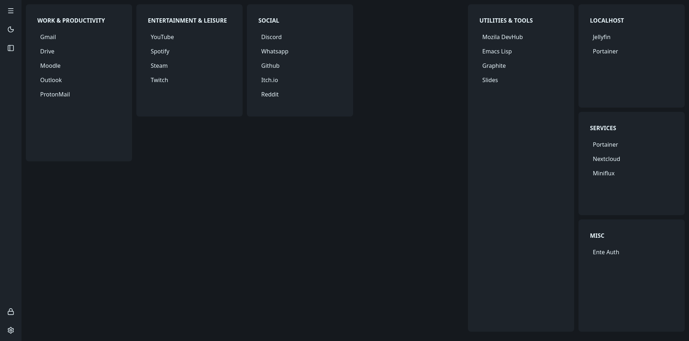
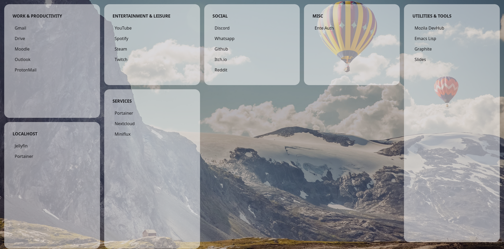
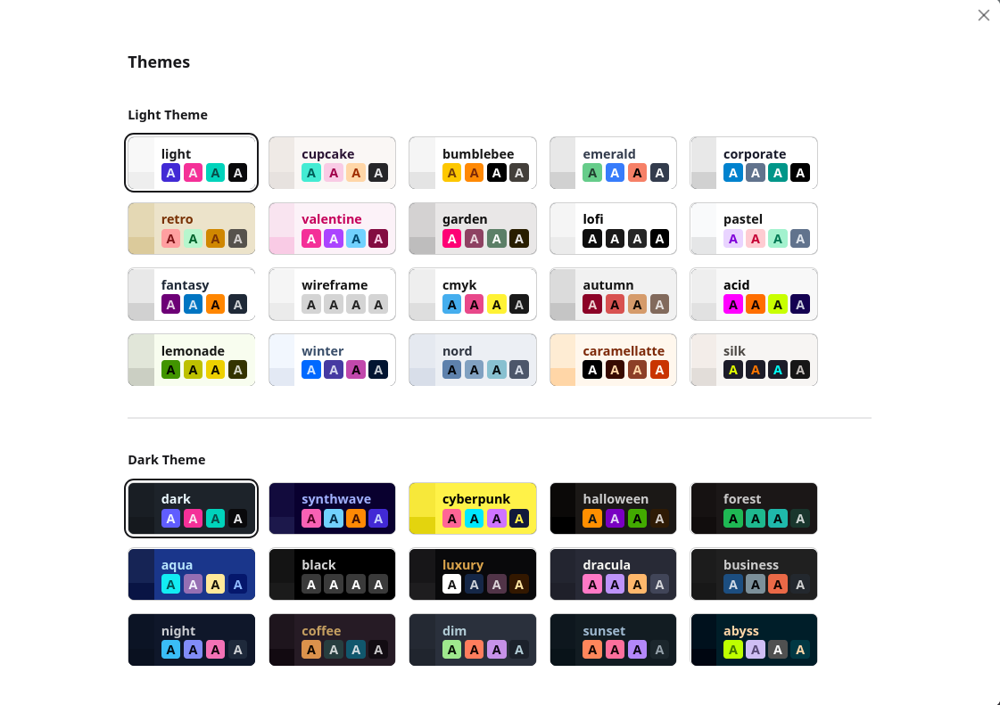

# Simple homepage
A simple homepage for Firefox made with Svelte.

## Important
- This extension is in very early development and the configuration file changes frequently.
- I strongly recommend for you to **KEEP A BACKUP** of your configuration and disable automatic updates.

## Installing
- Available on the [Mozilla Add-ons](https://addons.mozilla.org/en-US/firefox/addon/mookbark/) website.
## Screenshots
### Dark Preview

### Light with blur

### Themes

## Building from source
### Dependencies
- You need npm. On Debian: `sudo apt install npm`.

Use the `build.sh` script or build it manually:
- Clone the repo
- cd into the directory
- Run `npm install && npm run build`

It will build in the `dist` directory.
